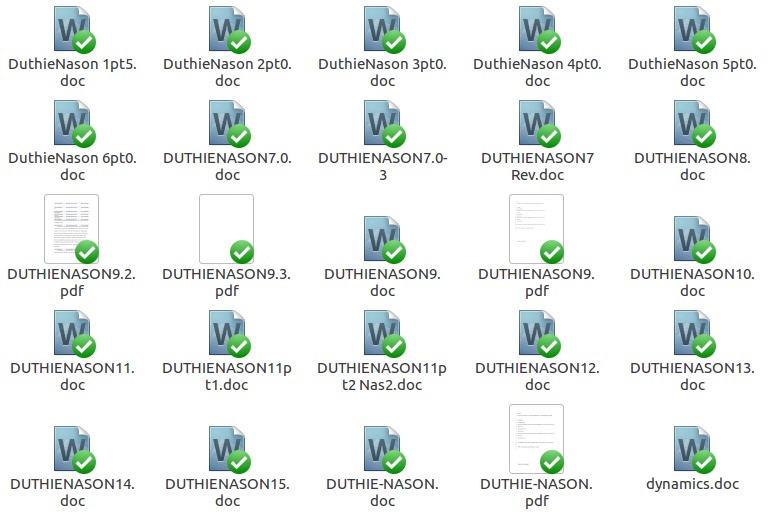

## Objectives for today

  

- Introduce the motivation behind Stirling Coding Club (semina[r] 2.0)
- Explain what [GitHub](http://github.com) is, what its most useful features are, and how to use them
- Get everyone [set up with a GitHub account](https://github.com/join), and SCC membership

## Objectives for the future

  

- Central place online to ask coding, modelling, and statistics questions
- Regular group meet-ups and online discussion using [GitHub](http://github.com)
- Friendly atmosphere for learning and developing code, modelling, and statistics

## Worldwide Coding Club Network

- Started with [Mozilla Science](https://github.com/mozillascience/studyGroup)
- Groups from 100+ places worldwide
- Links with the [University of Aberdeen](https://aberdeenstudygroup.github.io/studyGroup/) and the [University of Edinburgh](https://ourcodingclub.github.io/)
- Hundreds of open-source tutorials on coding related topics (including [GitHub](https://services.github.com/on-demand/intro-to-github/), and many on R)
- Integrate with and contribute to coding club networks

## Code of Conduct {.smaller}

Stirling Study Group events are community events intended for networking and collaboration as well as learning. We value the participation of every member of the scientific community and want all attendees to have an enjoyable and fulfilling experience. Accordingly, all attendees are expected to show respect and courtesy to other attendees throughout Stirling Study Group events, and in all interactions online associated with Stirling Study Group.

To make clear what is expected, everyone taking part in Stirling Study Group events and discussions --instructors, helpers, organisers, and learners -- is required to conform to the following Code of Conduct. Organisers will enforce this code throughout events, but you may also contact us privately; all communication will be treated as confidential.

**Thank you for helping make this a welcoming, friendly event for all.**

[Full code of conduct here](https://github.com/StirlingCodingClub/studyGroup/blob/gh-pages/codeOfConduct.md)

## Why GitHub, and why is GitHub?

 

- It's free (as long as you share)
- Not sharing is free ([if you're a student](https://help.github.com/articles/applying-for-a-student-developer-pack/))
- Largest community of coders (28+ million)
- Largest [collection](https://github.com/search) of repositories (95+ million)
- Built from git [version control](https://ourcodingclub.github.io/2017/02/27/git.html)

## Advantages of using GitHub

## Advantages of using GitHub

- Back up the [entire history](https://github.com/ConFooBio/gmse/commits/master) of a project
- [Collaboratively code](https://github.com/bradduthie/helicoverpa/commits/master) with colleagues
- Ask questions [on issues pages](https://github.com/tidyverse/ggplot2/issues)
- Fork, pull request, and merge code
- [Career development](https://github.com/FrancescaMancini) (evidence of work)

## What coding club can help you do

  

- Improve workflow of coding and manuscript writing
- Learn new coding, modelling, and statistical techniques
- Share new skills with colleagues
- Get help with problems

## How to learn and share knowledge

 

 

- Raise [issues](https://github.com/StirlingCodingClub/studyGroup/issues) in Stirling Coding Club
- [Suggest and vote on events](https://github.com/StirlingCodingClub/studyGroup/issues/6)
- Add repositories to GitHub
- [Fork](https://github.com/bradduthie/MSEtools) repositories of interest

 

## What you need to do to get started

 

- Get a [GitHub account](https://github.com/join)
- Join the [Stirling Coding Club](https://github.com/StirlingCodingClub)
- Propose SCC topics [as issues](https://github.com/StirlingCodingClub/studyGroup/issues/6)
- [Download](https://www.rstudio.com/products/rstudio/download/) and [install](http://rprogramming.net/download-and-install-rstudio/) Rstudio
- [Download](https://git-scm.com/downloads) and install git

 

