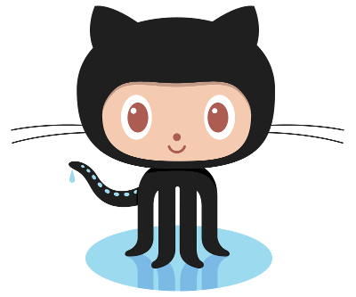

##

## Objectives for Stirling Coding Club

- Friendly atmosphere for learning and developing code, modelling, and statistics
- Regular group meet-ups and online discussion using [GitHub](http://github.com)

## Code of Conduct

Stirling Study Group events are community events intended for networking and collaboration as well as learning. We value the participation of every member of the scientific community and want all attendees to have an enjoyable and fulfilling experience. Accordingly, all attendees are expected to show respect and courtesy to other attendees throughout Stirling Study Group events, and in all interactions online associated with Stirling Study Group.

To make clear what is expected, everyone taking part in Stirling Study Group events and discussions --instructors, helpers, organisers, and learners -- is required to conform to the following Code of Conduct. Organisers will enforce this code throughout events, but you may also contact us privately; all communication will be treated as confidential.

## Code of Conduct {.smaller}

 - Stirling Study Group is dedicated to providing a harassment-free learning experience for everyone, regardless of gender, sexual orientation, disability, physical appearance, body size, race, religion, or choice of text editor. We do not tolerate harassment of participants in any form.
 - All communication should be appropriate for a professional audience including people of many different backgrounds. Sexual language and imagery is not appropriate for any event.
 - Be kind to others. Do not insult or put down other attendees.
 - Behave professionally. Remember that harassment and sexist, racist, or exclusionary jokes are not appropriate.
 - Attendees violating these rules may be asked to leave the event at the sole discretion of the event organisers without a refund of any charge that may have been levied.

Thank you for helping make this a welcoming, friendly event for all.

[Code of conduct continues here](https://github.com/StirlingCodingClub/studyGroup/blob/gh-pages/codeOfConduct.md)

## Why use GitHub

